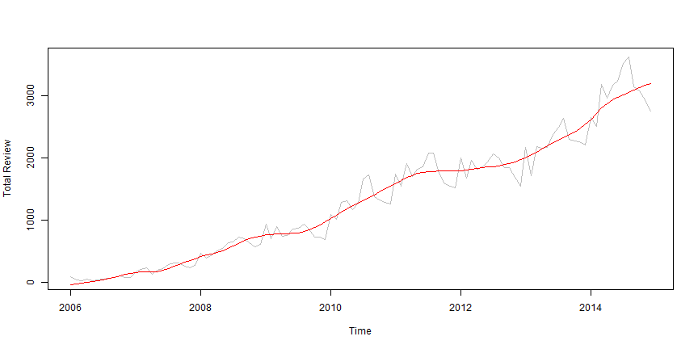
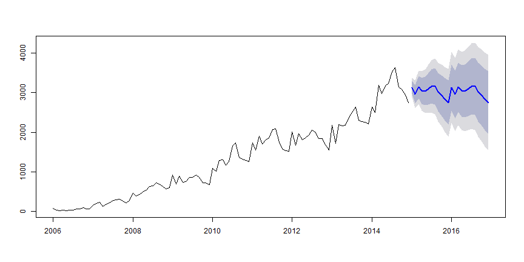

Data Science Capstone
========================================================
author: Lim Tee Yong
date: 19 November 2015

STL analysis of smoking business
========================================================

This is a  study of popularly on smoking business by looking into the number of reviews(talking points) on yelp data set challenge and understand the economic impact and very real economic trade-offs we should consider when voting on a smoking ban.

The yelp data can be find on

[yelp_dataset_challenge_academic_dataset.zip](https://d396qusza40orc.cloudfront.net/dsscapstone/dataset/yelp_dataset_challenge_academic_dataset.zip)

More on Yelp Dataset Challenge and the details of the data structure can be found on

http://www.yelp.com/dataset_challenge  

Background
========================================================

From the data set provide by Yelp, there are:

- a total of 61164 businesses
- only 2754 of businesses that are with the attribute smoking(both allowing indoor and outdoor)
- a total of 1569264 reviews and from the period of Oct 2004 to Jan 2015
- only 144080 reviews for the 2754 smoking businesses. 

It is surprisingly high for only 2754 businesses. 


Exploratory analysis
========================================================

After understanding the data, I converted the data into a Time Series Object
- only 2006 to 2014 data are use because they consist of full year data. The final transformed data will look like in fig.1


```
 Time-Series [1:108] from 2006 to 2015: 88 35 23 43 27 31 44 63 73 98 ...
```

*fig.1 - Final transformed data*

With this data we move on the build a basic model

Modelling
========================================================

After a few round of tuning and experiment with different settings. We are able to produce a final model for forcasting.

 

*fig.2 - Final model plot*

Forecast
========================================================

The 2 years forecast result in fig.3, show that it remain in same zone as of today. This somehow mean there is an economic impact.

 

*fig.3 - Forecast result*
